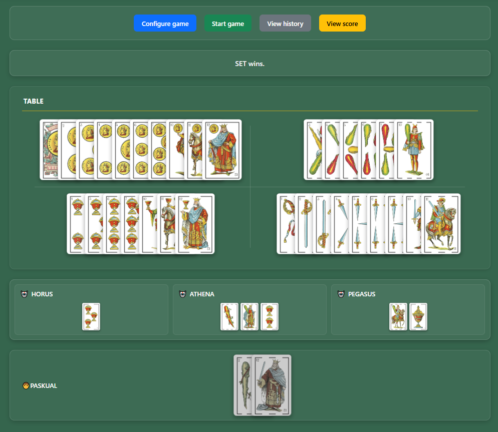
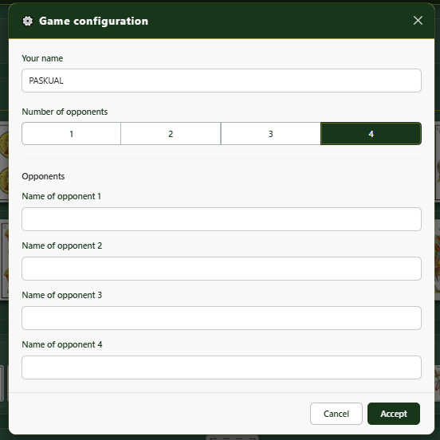
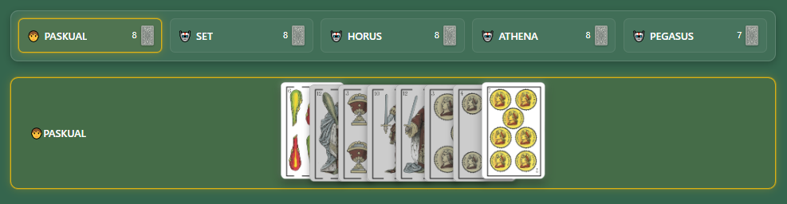
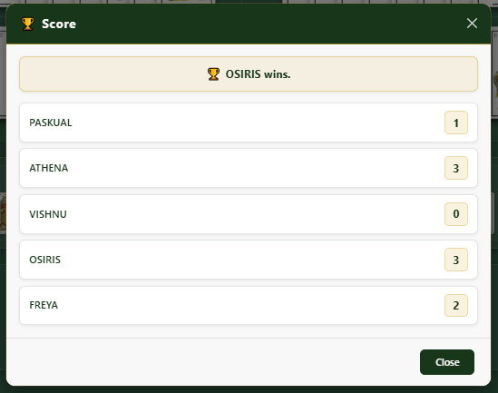
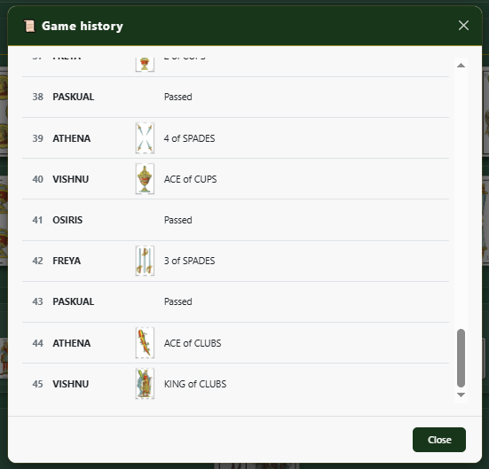

# 🃏 Seises 🃏

<p align="center">
  
</p>

<p align="center">
A modern browser implementation of the traditional Spanish card game
<strong>Seises</strong> or <strong>Los Seises</strong>, built with
<strong>Vanilla JavaScript</strong>, <strong>HTML5</strong>,
<strong>CSS3</strong> and <strong>Bootstrap 5</strong>.<br/>
Made with ❤️ and a lot of love.
</p>

<p align="center">


</p>

---

## ✨ Features

- Traditional Spanish **Seises** gameplay
- One human player against **1 to 4 AI opponents**
- Configurable human player name
- Custom names for AI opponents
- Automatic opponent name generation
- Spanish 40-card deck
- Special deck configuration for **three-player games**
- Clickable cards with visual indication of playable cards
- Interactive game board
- Dynamic player panels
- Dynamic game status panel
- Game configuration modal
- Scoreboard with victory tracking
- Game history for the current match
- End-of-game dialog
- English and Spanish language support
- Persistent language selection
- Responsive interface built with **Bootstrap 5**
- Built entirely with **Vanilla JavaScript**

## 📸 Screenshots

The following screenshots showcase the main features and interface components of **Seises 3.1**.

### Game Board



### Game Configuration



### Playable Cards



### Scoreboard



### Game History



---

## 📖 How to Play

**Seises** is played with a traditional Spanish card deck.

The game is played with one human player and between one and four computer-controlled opponents.

The objective is simple: **be the first player to get rid of all your cards.**

### Game Configuration

Before starting a game, the player can:

- Enter their own name.
- Choose between **1 and 4 AI opponents**.
- Enter custom names for the opponents.
- Leave opponent names empty to let the game generate names automatically.

### Gameplay

- The game starts with the **6 of Coins**.
- Once a suit has been opened, only the immediately higher or lower card of that same suit may be played.
- The Spanish deck follows this card order:

```text
1 → 2 → 3 → 4 → 5 → 6 → 7 → 10 → 11 → 12
```

- Since the Spanish deck has no **8** or **9**, the **10** is played immediately after the **7**.
- When playing with three players, all four 2s are removed from the deck so that the remaining cards can be dealt evenly.
- If a player has no valid move available, they must pass their turn.
- The first player to play all their cards wins the game.

### Example

If the table contains:

```text
5 Coins 
6 Coins 
7 Coins
```

the next valid card is:

```text
10 Coins
```

and:

```text
4 Coins
```

can also be played.

### Scoreboard

At the end of each game, the scoreboard displays the current score for all players.

The winner is indicated in the end-of-game dialog, while the remaining cards of the other players are displayed on the game board.

### Game History

The game keeps a history of the moves played during the current match, including cards played and passes.

---

## 🚀 Getting Started

Clone the repository:

```bash
git clone https://github.com/mikepaskual/seises.git
```

Open the project folder and launch:

```text
index.html
```
The game runs entirely in the browser and requires no server-side components.

---

## 🛠️ Technologies

- HTML5
- CSS3
- Vanilla JavaScript (ES6+)
- Bootstrap 5.3.8
- Underscore.js
- LocalStorage API

---

## 📁 Project Structure

```text
.
├── assets
│   ├── css
│   ├── images
│   │   ├── cards
│   │   └── screenshots
│   ├── i18n
│   │   ├── en.js
│   │   └── es.js
│   └── js
│       ├── i18n.js
│       ├── juego.js
│       └── underscore-min.js
│
├── .gitignore
├── index.html
├── LICENSE
└── README.md
```

---

## 📌 Version History

### ✅ Version 1.0

- Traditional Seises gameplay
- Single-player mode against AI
- Spanish deck
- Victory / defeat counter

### ✅ Version 2.0

- Clickable cards
- Modernized interface
- Dynamic status panel
- Internationalization (English / Spanish)

### ✅ Version 3.0

- Redesigned game engine
- Support for multiple AI opponents
- Custom player names
- Automatic opponent name generation
- Game configuration
- Improved game board and player interface
- Visual indication of playable cards
- Dynamic player panels
- Scoreboard
- Game history
- End-of-game dialog
- Improved game state management
- English / Spanish internationalization
- Persistent language selection
- Bootstrap 5 interface

### ✅ Version 3.1

- Improved visual indication of the active player and playable cards
- Improved end-of-game experience
- Improved game status and turn feedback
- Improved scoreboard presentation

---

## 🤝 Contributing

Contributions, suggestions and ideas are always welcome.

Feel free to open an issue or submit a pull request.

---

## 📄 License

This project is licensed under the MIT License.

See the **LICENSE** file for more information.

---

<p align="center">
Developed with ❤️ by <a href="https://github.com/mikepaskual">Miguel A. Pascual</a>
</p>