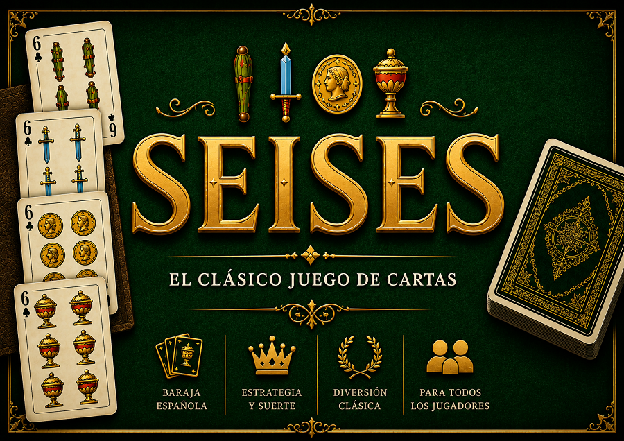
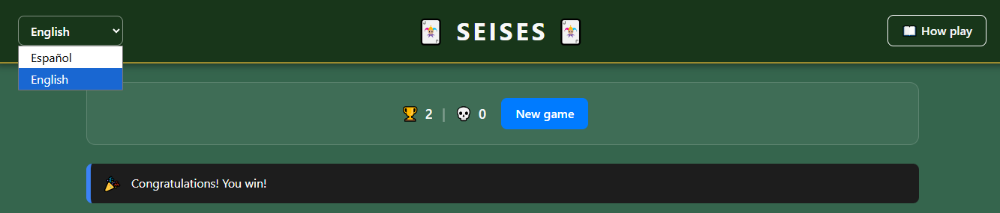
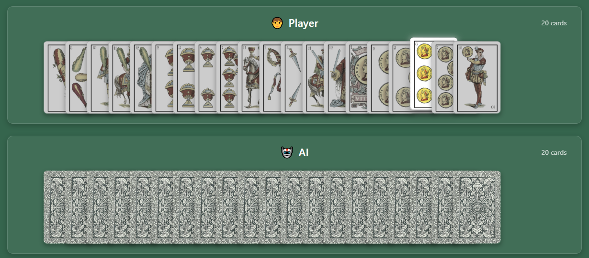
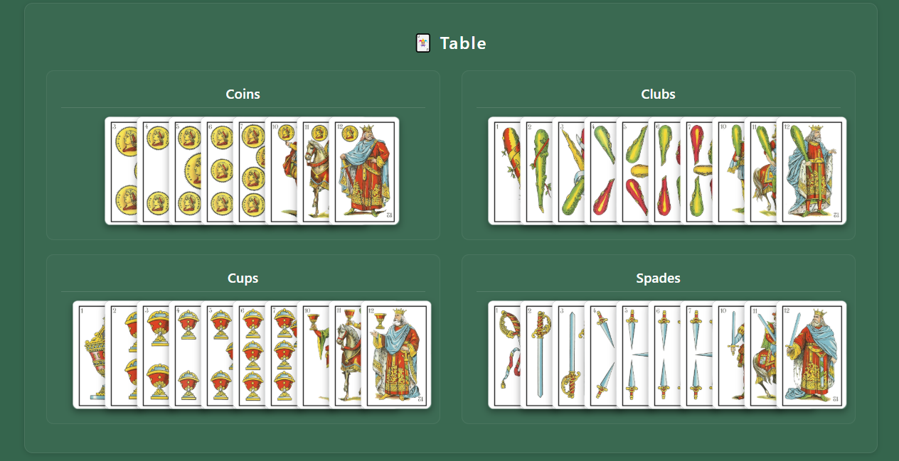

# 🃏 Seises

<p align="center">
  
</p>

<p align="center">
A modern browser implementation of the traditional Spanish card game <strong>Seises</strong> or <strong>Los Seises</strong>, built with <strong>Vanilla JavaScript</strong>, <strong>HTML5</strong> and <strong>CSS3</strong>.
</p>

<p align="center">


</p>

---

## ✨ Features

- Traditional Spanish **Seises** gameplay
- Single-player mode against AI
- Spanish 40-card deck
- Clickable cards (no drop-down menus)
- Interactive game board
- Dynamic status panel
- English and Spanish language support
- Language selector with persistence
- Victory and defeat counter
- Modern responsive interface
- Built entirely with Vanilla JavaScript

---

## 📸 Screenshots

### Selector Language



### Clickable Cards



### Game Board



---

## 📖 How to Play

**Seises** is played with a traditional 40-card Spanish deck.

At the beginning of the game, the deck is shuffled and dealt equally between both players.

The objective is simple: **be the first player to get rid of all your cards.**

### Gameplay

- The game begins when the first **Six** of any suit is played.
- Once a suit has been opened, only the immediately higher or lower card of that same suit may be played.
- In the Spanish deck, the card order is:

```text
1 → 2 → 3 → 4 → 5 → 6 → 7 → 10 → 11 → 12
```

- Since the Spanish deck has no **8** or **9**, the **10** is played immediately after the **7**.
- If a player has no valid move available, they must pass their turn.
- The first player to play all their cards wins the game.

### Example

If the table contains:

```text
5 Oros 
6 Oros 
7 Oros
```

the next valid card is:

```text
10 Oros
```

and:

```text
4 Oros
```

---

## 🚀 Getting Started

Clone the repository:

```bash
git clone https://github.com/mikepaskual/seises.git
```

Open the project folder and launch:

```text
index.html
```
The game runs entirely in the browser and requires no server-side components.

---

## 🛠️ Technologies

- HTML5
- CSS3
- Vanilla JavaScript (ES6+)
- Bootstrap 4.4.1
- Underscore.js
- LocalStorage API (language persistence)

---

## 📁 Project Structure

```text
.
├── assets
│   ├── css
│   ├── images
│   │   ├── cards
│   │   └── screeshots
│   ├── i18n
│   │   ├── en.js
│   │   └── es.js
│   └── js
│       ├── i18n.js
│       ├── juego.js
│       └── underscore-min.js
│
├── .gitignore
├── index.html
├── LICENSE
└── README.MD
```

---

## 🚧 Roadmap

### ✅ Version 1.0

- Traditional gameplay
- Single-player mode against AI
- Spanish deck
- Victory / Defeat counter

### ✅ Version 2.0

- Clickable cards
- Modernized interface
- Dynamic status panel
- Internationalization (English / Spanish)

### 🔜 Next milestones

- Support for multiple players
- Custom player names
- Smarter AI
- Local game persistence
- Statistics and match history
- Visual improvements and animations

---

## 🤝 Contributing

Contributions, suggestions and ideas are always welcome.

Feel free to open an issue or submit a pull request.

---

## 📄 License

This project is licensed under the MIT License.

See the **LICENSE** file for more information.

---

<p align="center">
Developed with ❤️ by <a href="https://github.com/mikepaskual">Miguel A. Pascual</a>
</p>